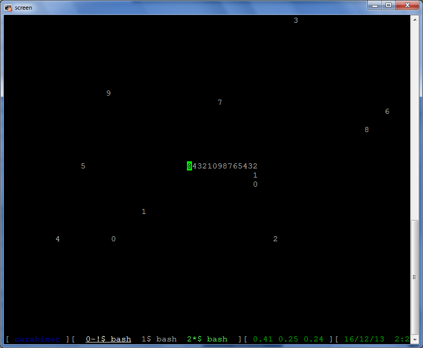

## Pysnake

It's the snake game, but for your terminal! And with a couple of additional features.

## Setup

1. Clone the repository or [download the game file alone](https://raw.githubusercontent.com/relsqui/pysnake/master/pysnake.py).
1. `python pysnake.py`

## Play

### Goals

 * Collect all the treats in the sequence, in order, as many times as you can.
   (The snake's tail demonstrates one complete sequence, starting from the
   end and finishing at the head, when the game starts.)
 * Every treat you collect is added to your tail.
 * Every time you collect a complete set of treats, a rock appears and impedes
   your path.
 * The game ends when you eat a treat out of order or collide with a rock,
   your tail, or an edge (if edge wrapping is turned off).

### Controls

These are the defaults; they can be changed in the top of the script.

 * Direct your snake using **hjkl**, **wasd**, or **arrow keys**.
 * You can pause at any time by pressing **space** or **p**; press either one
   again to unpause.
 * You can end the game at any time by pressing **q**.

### Bonus Items

Special items for you to collect might appear, depending on configuration.
They don't make your tail longer, they're just for bragging rights.

 * Gems may occasionally appear at random.
 * When there are enough rocks on the board, they may all turn into gems.
 * When there are enough gems on the board, they may all turn into a single
   trophy.

## Configuration

You can change a lot of settings by altering the all-caps variables in the
beginning of the script.

To make the playing field bigger or smaller, resize your terminal.
